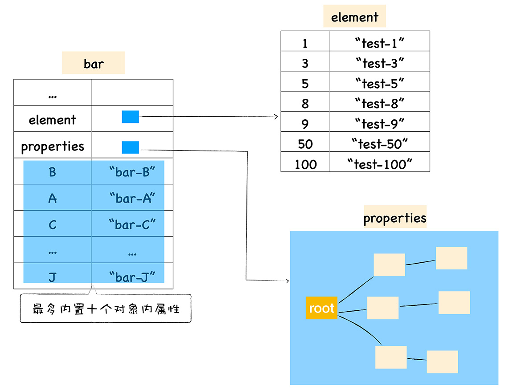
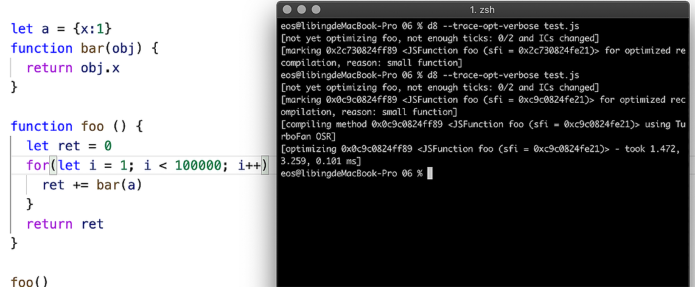
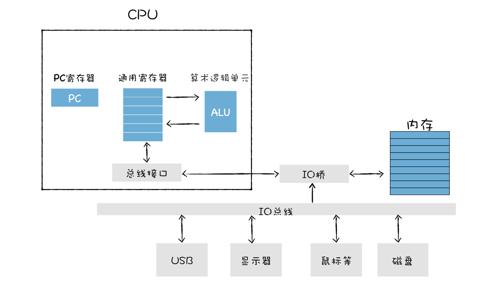
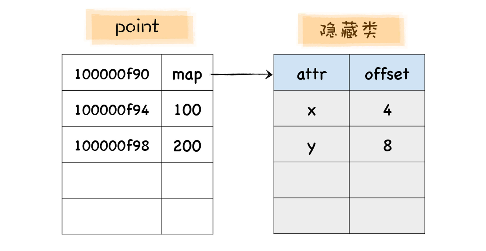
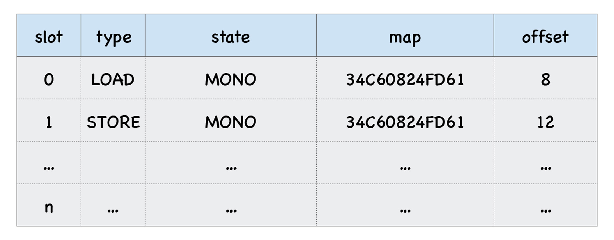
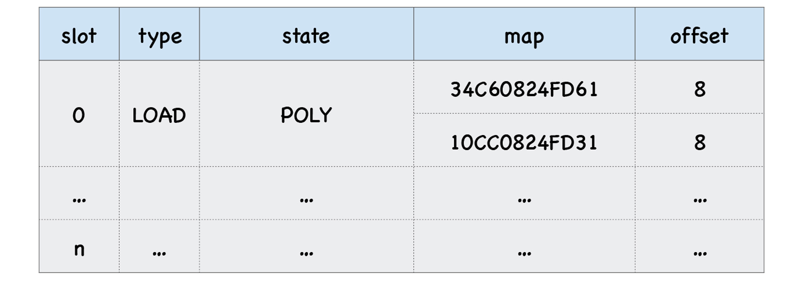
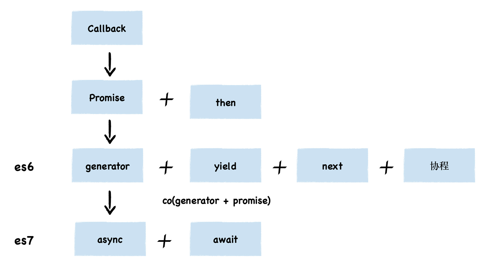
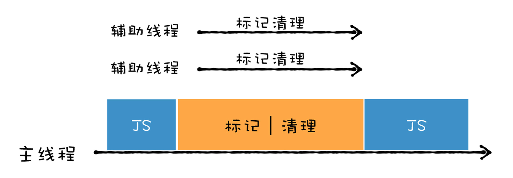
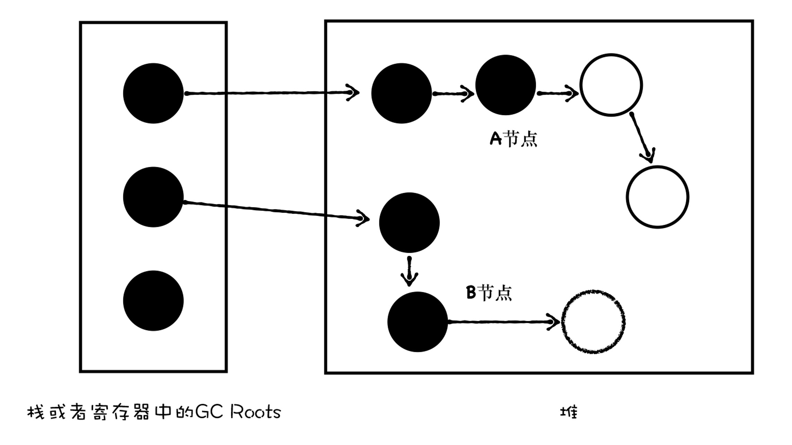
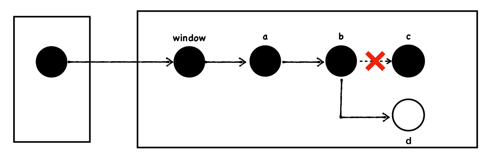

## 开篇词：如何学习V8

### 如何学习V8？
先了解 JavaScript 这门语言的基本特性和设计思想，再学习V8执行 JavaScript 代码的完整流程。

---

## 1. V8是如何执行一段JavaScript代码的？

### 什么是V8？
V8 是由 Google 开发的开源 JavaScript 引擎，也被称为虚拟机，模拟实际计算机各种功能来实现代码的编译和执行。

### 高级代码为什么需要先编译再执行？
CPU 具有指令集（机器语言）用于实现各种功能，但是只能识别二进制的指令，不能直接识别由高级语言所编写的代码。有两种方式可以执行高级代码。  
1. 解释执行
    - 先将输入的源代码通过解析器编译成中间代码，之后直接使用解释器解释执行中间代码，然后直接输出结果。
    - 特点：启动速度快，执行时速度慢
2. 编译执行
    - 先将源代码转换为中间代码，然后编译器再将中间代码编译成机器代码并保存，在需要执行时直接执行。
    - 特点：启动速度慢，执行时的速度快

### V8 是怎么执行 JavaScript 代码的？
V8 使用即时编译技术（Just In Time），即混合编译执行和解释执行这两种手段。流程如下：
1. 初始化执行环境，包括“堆和栈空间”、“全局执行上下文”、“全局作用域”、“事件循环系统”等。
2. 解析（结构化）源代码，生成AST、作用域。
3. 解释器依据AST、作用域生成字节码，按照顺序解释字节码。
4. 监听热点代码。
    1. 重复多次执行的一段代码会被标记为热点代码
    2. 优化编译器将该段代码字节码编译为二进制代码并优化代码
    3. 该代码重复被执行时直接执行优化的二进制代码
    4. 执行过程中，如果对象的结构被动态修改了，优化代码无效。优化编译器执行反优化操作，经过反优化的代码下次执行时回退到解释器解释执行。


### 跟踪一段实际代码的执行流程
新建如下JS文件，并使用 D8 执行命令
```JavaScript
// test.js
var test = 'GeekTime'
```
```shell
# 命令
d8 --print-ast test.js # 查看AST
d8 --print-scopes test.js # 查看作用域
d8 --print-bytecode test.js # 生成字节码
d8 --trace-opt test.js # 查看优化的代码
pt --trace-deopt test.js # 查看反优化的代码
```

### 思考题：除了 V8 采用了 JIT 技术，还有哪些虚拟机采用了 JIT 技术？
JVM以及luajit，包括oracle最新的graalVM都已经采用了JIT技术。

### 评论补充：安装 js 引擎
1. mac使用 jsvu
    1. 全局安装 jsvu： `npm install jsvu -g`
    2. 将~/.jsvu路径添加到系统环境变量中：`export PATH="${HOME}/.jsvu:${PATH}"`
    3. 可以直接通过命令参数指定：`jsvu --os=mac64 --engines=v8-debug`。
2. mac使用brew install v8

---

## 2. 函数即对象：JavaScript的函数特点
如果某个编程语言的函数，可以和这个语言的数据类型做一样的事情，我们就把这个语言中的函数称为一等公民。在 JavaScript 中，函数是一等公民。

### 函数的本质
函数是一种特殊的对象，它和对象一样可以拥有属性和值，但是函数和普通对象不同的是，函数可以被调用。

### V8 内部是怎么实现函数可调用特性的呢？
在 V8 内部，会为函数对象添加了两个隐藏属性，分别是 name 属性和 code 属性。name 属性的值就是函数名称，name 的默认属性值是 anonymous，表示函数对象没有被设置名称。code 属性代表函数代码，以字符串形式存储在内存中。当执行到该函数时，V8 会取出 code 属性值再解释执行。

### 函数关联了哪些内容
- 基础的属性和值
- 相关的执行上下文

### 思考题：哪些语言天生支持“函数是一等公民”？
kotlin和go、Python、Dart

---

## 3. 快属性和慢属性：V8是怎样提升对象属性访问速度的？

### 常规属性和排序属性
在 V8 内部，为了有效地提升存储和访问这两种属性的性能，分别使用了两个线性数据结构来分别保存排序属性和常规属性。
- 排序属性：数字属性，在V8 中称为element，按照索引值大小升序排列。
- 常规属性：字符串属性，在 V8 中被称为 properties，根据创建时的顺序升序排列。


为了优化在查找元素时，需要先找到 properties 对象才能找到对应的属性，多了一步操作而影响元素查找效率的问题，部分常规属性直接存储到对象本身，即对象内属性 (in-object properties)。对象内属性的数量是固定的，默认是 10 个，如果添加的属性超出了对象分配的空间，则它们将被保存在常规属性存储中。


### 快属性和慢属性
V8 具有快属性和慢属性两种存储策略，如果一个对象的属性过多时，V8 就会采取“慢属性”策略。
- 快属性：保存在线性数据结构中的属性。访问速度快，添加或者删除执行效率低，会产生大量时间和内存开销。
- 慢属性：保存在属性字典（hash表）中的属性。


### 实践：在 Chrome 中查看对象布局
控制台执行以下代码->->Memory->左侧的小圆圈（take heap snapshot）->搜索Foo，查看系统快照。  
```JavaScript
function Foo(property_num, element_num) {
  //添加可索引属性
  for (let i = 0; i < element_num; i++) {
    this[i] = `element${i}`
  }
  //添加常规属性
  for (let i = 0; i < property_num; i++) {
    let ppt = `property${i}`
    this[ppt] = ppt
  }
}
var bar = new Foo(10, 10)
var bar2 = new Foo(20,10)
var bar3 = new Foo(500,10)
```
观察系统快照，除了 elements 和 properties 属性，V8 还为每个对象实现了 map 属性和`__proto__`属性。`__proto__`属性就是原型，是用来实现 JavaScript 继承的，map 则是隐藏类。

### 思考题：结合文中介绍的快属性和慢属性，给出不建议使用 delete 的原因
如果删除属性在线性结构中，删除后需要移动元素，开销较大。
如果删除属性在慢属性中，可能需要将慢属性重排到快属性。

### 补充材料
[补充材料](https://www.cnblogs.com/chargeworld/p/12236848.html)

---

## 4. 函数表达式

### 函数声明与函数表达式的差异
这两种定义函数的方式具有不同语义，不同的语义触发了不同的行为。
```JavaScript
// 函数声明
function foo(){
  return 1
}
// 函数表达式
foo = function (){
  console.log('foo')
}
```

### V8 是怎么处理函数声明的？
在变量提升阶段，V8 并不会执行赋值的表达式，该阶段只会分析基础的语句，比如变量的定义，函数的声明。
在编译阶段，如果解析到函数声明，那么 V8 会将生成函数对象，并将该对象提升到作用域中。如果解析到了某个变量声明，也会将其放到作用域中，但是会将其值设置为 undefined，表示该变量还未被使用。

### 立即调用的函数表达式（IIFE）
- 定义：因为小括号之间存放的必须是表达式，函数放在括号里就成了函数表达式，它会返回一个函数对象。如果我直接在表达式后面加上调用的括号，这就称为立即调用函数表达式（IIFE）。
- 作用：V8 在编译阶段，并不会为该表达式创建函数对象，所以不会污染环境。可用于封装一些变量、函数，可以起到变量隔离和代码隐藏的作用。
- 代码
```JavaScript
(function () {
    //statements
})()
```

---

## 5. 原型链：V8是如何实现对象继承的？
继承就是一个对象可以访问另外一个对象中的属性和方法。最典型的两种实现继承方式是**基于类的设计**和**基于原型继承**的设计。

### 基于类的设计和基于原型继承特点
基于原型继承：提供了非常复杂的规则，并提供了非常多的关键字，诸如 class、friend、protected、private、interface 等，通过组合使用这些关键字实现继承。
基于原型继承：省去了很多基于类继承时的繁文缛节，简洁优美。

### 原型和原型链（原型继承是如何实现的？）
V8 为每个对象都设置了一个 __proto__ 属性，该属性直接指向了该对象的原型对象，原型对象也有自己的 __proto__ 属性，这些属性串连在一起就成了原型链。每个对象都可以通过 __proto__ 属性直接访问其原型对象的方法或者属性。

### 不建议直接使用 __proto__ 属性访问/修改属性
- 这是隐藏属性，并不是标准定义的
- 使用该属性会造成严重的性能问题

### 构造函数是怎么创建对象的？（new函数做了什么？）
1. 创建了一个空白对象
2. 设置该对象的原型对象为构造函数的 prototype 属性
3. 以该对象为上下文调用构造函数（fun.call(instance)），并传入参数

### 构造函数怎么实现继承？
```JavaScript
function DogFactory(type,color){
    this.type = type
    this.color = color
}
DogFactory.prototype.constant_temperature = 1
var dog1 = new DogFactory('Dog','Black')
```

### 思考题：DogFactory.prototype 和 DogFactory._proto_ 这两个属性之间有关联吗？
DogFactory 是 Function 构造函数的一个实例，所以 DogFactory.__proto__ === Function.prototype
DogFactory.prototype 是调用 Object 构造函数的一个实例，所以 DogFactory.prototype.__proto__ === Object.prototype
因此 DogFactory._proto_ 和 DogFactory.prototype 没有直接关系

---

## 6. 作用域链：V8是如何查找变量的？

### 什么是函数作用域和全局作用域？
- 定义：作用域就是存放变量和函数的地方，全局作用域中存放了全局环境中声明的变量和函数，函数作用域中存放了函数中声明的变量和函数。
- 区别：全局作用域是在 V8 启动过程中就创建了，且一直保存在内存中不会被销毁的，直至 V8 退出。 而函数作用域是在执行该函数时创建的，当函数执行结束之后，函数作用域就随之被销毁掉了。

### 作用域链是怎么工作的？
作用域链即作用域查找的路径，因为 JavaScript 是基于词法作用域（静态作用域）的，所以查找作用域的顺序是按照函数定义时的位置来决定的。
根据ECMAScript最新规范，函数对象有一个`[[Environment]]`内部属性，保存的是函数创建时当前正在执行的上下文环境，当函数被调用并创建执行上下文时会以`[[Environment]]`的值初始化作用域链，所以从规范也可以得知函数的作用域只跟函数创建时的当前上下文环境有关。

---

## 7. 类型转换：V8是怎么实现1+"2"的？

### 类型系统
在计算机科学中，类型系统（type system）用于定义如何将编程语言中的数值和表达式归类为许多不同的类型，如何操作这些类型，这些类型如何互相作用。

### V8 执行加法操作对象如何转换？
先调用对象的 valueOf 方法，如果没有 valueOf 方法，则调用 toString 方法，如果 vauleOf 和 toString 两个方法都不返回基本类型值，便会触发一个 TypeError 的错误。（string和date是例外，默认先调用toString）


---

## 8. 答疑：如何构建和使用V8的调试工具d8？
d8 是一个非常有用的调试工具，你可以把它看成是 debug for V8 的缩写。

### 如何通过 V8 的源码构建 D8？
1. 执行 `npm i jsvu -g`
2. 添加 .jsvu 的位置（windows用户在C:\Users\账号\.jsvu）系统环境变量的 Path
3. 执行 `jsvu`，选择自己的操作系统、需要安装的JS引擎（v8 或者 v8-debug）
4. 将 v8-debug 改名为 d8，即可运行第一节的命令行，否则命令中要使用v8-debug 替代 d8。如果使用 v8 运行需要把命令中的 d8 改为 v8。

### 如何使用 d8？
使用命令 `d8 --help` 查看所有命令、`d8 --help |grep print` 过滤查看打印命令。
windows环境需要下载[grep](https://sourceforge.net/projects/gnuwin32/files/grep/2.5.4/grep-2.5.4-setup.exe/download?use_mirror=managedway)，并配置环境变量

### 打印优化数据
在code文件夹中执行如下命令，运行结果如图
```shell
d8 --trace-opt-verbose 查看优化.js
```

图中可看到优化信息如下，第一行代表已经使用 TurboFan 优化编译器将函数 foo 优化成了二进制代码，第二行 V8 采取了 TurboFan 的 OSR(On-Stack Replacement) 优化，它是一种在运行时替换正在运行的函数的栈帧的技术，如果在 foo 函数中，V8 需要不断为 bar 函数创建栈帧，销毁栈帧，必会影响到 foo 函数的执行效率。于是，V8 采用了 OSR 技术，将 bar 函数和 foo 函数合并成一个新的函数。
```shell
<JSFunction foo (sfi = 0x2c730824fe21)> for optimized recompilation, reason: small function]
<JSFunction foo (sfi = 0xc9c0824fe21)> using TurboFan OSR]
```

### 查看垃圾回收
在code文件夹中执行如下命令，运行结果如图
```shell
d8 --trace-gc 查看垃圾回收.js
d8 --trace-gc 查看垃圾回收1.js
```


`Scavenge 1.2 (2.4) -> 0.3 (3.4) MB, 0.9 / 0.0 ms  (average mu = 1.000, current mu = 1.000) allocation failure`的意思是提示“Scavenge … 分配失败”，是因为垃圾回收器 Scavenge 所负责的空间已经满了，Scavenge 主要回收 V8 中“新生代”中的内存，大多数对象都是分配在新生代内存中，内存分配到新生代中是非常快速的，但是新生代的空间却非常小，通常在 1～8 MB 之间，一旦空间被填满，Scavenge 就会进行“清理”操作。

### 内部方法
V8 提供的一些内部方法，在启动 V8 时传入 allow-natives-syntax 命令即可使用，如下所示，可查看快属性：
```shell
d8 --allow-natives-syntax 检查快属性.js
```
其他内部方法可参考[这里](https://github.com/v8/v8/blob/4b9b23521e6fd42373ebbcb20ebe03bf445494f9/src/runtime/runtime.h)

### 思考题：什么情况下，V8 会将多个函数合成一个函数？
频繁创建栈帧，销毁栈帧的时候（个人想法）

### 评论补充：编译好的d8工具
[mac平台](https://storage.googleapis.com/chromium-v8/official/canary/v8-mac64-dbg-8.4.109.zip)
[linux32平台](https://storage.googleapis.com/chromium-v8/official/canary/v8-linux32-dbg-8.4.109.zip)
[linux64平台](https://storage.googleapis.com/chromium-v8/official/canary/v8-linux64-dbg-8.4.109.zip)
[win32平台](https://storage.googleapis.com/chromium-v8/official/canary/v8-win32-dbg-8.4.109.zip)
[win64平台](https://storage.googleapis.com/chromium-v8/official/canary/v8-win64-dbg-8.4.109.zip)

---

## 9. 运行时环境：运行JavaScript代码的基石
在执行 JavaScript 代码之前，V8 就已经准备好了代码的运行时环境，这个环境包括了堆空间和栈空间、全局执行上下文、全局作用域、内置的内建函数、宿主环境提供的扩展函数和对象，还有消息循环系统。

### V8 与宿主环境
因为 V8 只提供 JavaScript 的核心功能和垃圾回收系统，不是一个完整的系统，所以在执行 V8 需要有宿主环境提供基础功能部件，这包括了全局执行上下文、事件循环系统，堆空间和栈空间。  
宿主环境可以是浏览器中的渲染进程，可以是 Node.js 进程, 也可以是其他的定制开发的环境。浏览器为 V8 提供基础的消息循环系统、全局变量、Web API。

### 构造数据存储空间：堆空间和栈空间
- 栈空间
  - 作用：管理 JavaScript 函数调用的。函数调用过程涉及到上下文相关的内容都会存放在栈上，比如原生类型、引用到的对象的地址、函数的执行状态、this 值等都会存在在栈上。函数执行结束后该函数的执行上下文便会被销毁掉。
  - 特点：内存中空间连续，每个元素地址固定，查找效率高，但是在内存中不容易找到很大的连续空间，所以大小有限。遵循“先进后出”策略。
- 堆空间
  - 作用：用来存储对象类型的离散的数据。
  - 特点：数据不是线性存储的，可以存放很多数据，但是读取的速度会比较慢。

### 全局执行上下文和全局作用域
- 执行上下文
  - 用于维护执行当前代码所需要的变量声明、this 指向等。
  - 主要包含三部分，变量环境、词法环境和 this 关键字。比如在浏览器的环境中，全局执行上下文中就包括了 window 对象，还有默认指向 window 的 this 关键字、一些 Web API 函数，诸如 setTimeout、XMLHttpRequest 等内容。而词法环境中，则包含了使用 let、const 等变量的内容。
  - 全局执行上下文在 V8 的生存周期内是不会被销毁的，它会一直保存在堆中
- 全局作用域和全局执行上下文的关系：同一个全局执行上下文中能存在多个作用域。

### 构造事件循环系统
- 主线程：V8 没有自己的主线程，需要宿主环境提供主线程，用来执行 JavaScript 和执行垃圾回收等工作。  
- 事件循环系统：让线程执行完代码后不会自动退出，循环获取任务。用来处理任务的排队和任务的调度。
- 消息队列：主线程执行任务时，暂存到达的任务。事件循环系统会从消息队列中取出正在排队的任务。
来处理任务的排队。
- 注意点：因为所有的任务都是运行在主线程的，在浏览器的页面中，V8 会和页面共用主线程，共用消息队列，所以如果 V8 执行一个函数过久，会影响到浏览器页面的交互性能。

### 思考题：作用域和执行上下文是什么关系？
1. 作用域是静态的，函数定义的时候就已经确定了。
2. 执行上下文是动态的，调用函数时候创建，结束后还会释放。

---

## 10. 机器代码：二进制机器码究竟是如何被CPU执行的？
在执行代码时，V8 首先需要将 JavaScript编译成字节码或者二进制代码，然后再执行。

### 将源码编译成机器码
执行`gcc -O0 -o code_prog code.c`，通过 GCC 编译器将文件`code.c`编译成二进制文件。
执行`objdump -d code_prog`，进行反汇编。

### CPU 是怎么执行程序的？
1. 二进制代码装载进内存，系统会将第一条指令的地址写入到 PC 寄存器中。
2. 读取指令：根据pc寄存器中地址，读取到第一条指令，并将pc寄存器中内容更新成下一条指令地址。
3. 分析指令：并识别出不同的类型的指令，以及各种获取操作数的方法。
4. 执行指令：由于cpu访问内存花费时间较长，因此cpu内部提供了通用寄存器，用来保存关键变量，临时数据等。指令包括加载指令，存储指令，更新指令，跳转指令。如果涉及加减运算，会额外让ALU进行运算。
5. 指令完成后，通过pc寄存器取出下一条指令地址，并更新pc寄存器中内容，再重复以上步骤。


### 通用寄存器
- 定义：CPU 中用来存放数据的设备。
- 特点：容量小，读写速度快。
- 专用的通用寄存器：rbp 寄存器（存放栈帧指针），rsp 寄存器（存放栈顶指针），PC 寄存器（存放下一条要执行的指令）

### 常用的指令类型
- 加载的指令：从内存中复制指定长度的内容到通用寄存器中，并覆盖寄存器中原来的内容。
- 存储的指令：将寄存器中的内容复制内存某个位置，并覆盖掉内存中的这个位置上原来的内容。
- 更新指令：复制两个寄存器中的内容到 ALU 中，也可以是一块寄存器和一块内存中的内容到 ALU 中，ALU 将两个字相加，并将结果存放在其中的一个寄存器中，覆盖该寄存器中的内容。
- 跳转指令：从指令本身抽取出一个字，这个字是下一条要执行的指令的地址，并将该字复制到 PC 寄存器中，并覆盖掉 PC 寄存器中原来的值。
- IO 读 / 写指令：从一个 IO 设备中复制指定长度的数据到寄存器中，或者将一个寄存器中的数据复制到指定的 IO 设备。

### 分析一段汇编代码的执行流程


---

## 11. 堆和栈：函数调用是如何影响到内存布局的？

### 为什么使用栈结构来管理函数调用？
- 函数的生命周期和函数的资源分配情况都符合后进先出 (LIFO) 的策略。
- 在栈上分配资源和销毁资源的速度非常快，这主要归结于栈空间是连续的，分配空间和销毁空间只需要移动下指针就可以了。

### 恢复现场、栈帧指针
- 恢复现场：被调用函数执行完之后，将栈的状态恢复到调用者函数上次执行时的状态。实现只需要将栈顶指针向下移动到函数的起始位置。
- 栈帧指针：一个函数的起始位置。每个栈帧对应着一个未运行完的函数，栈帧中保存了该函数的返回地址和局部变量。

### esp 寄存器、ebp 寄存器
- esp 寄存器：存放栈顶指针
- ebp 寄存器：存放当前函数的栈帧指针

### 栈如何管理函数调用？
假设函数main调用函数add，其流程如下：
1. main被执行时，其参数、函数内部定义变量都会依次压入到栈中。
2. 调用add函数，在栈中保存main 函数的栈帧指针，再把add的参数、变量依次压栈。
3. add执行完时恢复现场。

### 栈的缺点
在内存中分配一块连续的大空间是非常难的，因此栈空间是有限的，容易导致栈溢出。

---

## 12. 延迟解析：V8是如何实现闭包的？
V8 执行 JavaScript 代码，需要经过编译和执行两个阶段，其中编译过程是指 V8 将 JavaScript 代码转换为字节码或者二进制机器代码的阶段，而执行阶段则是指解释器解释执行字节码，或者是 CPU 直接执行二进制机器代码的阶段。总流程如下：


### 惰性解析
- 定义：惰性解析是指解析器在解析的过程中，如果遇到函数声明，那么会跳过函数内部的代码，并不会为其生成 AST 和字节码，而仅仅生成顶层代码的 AST 和字节码。
- 作用：避免一次性解析编译的问题：
    1. 增加编译时间，严重影响首次执行代码的速度。
    2. 解析完成的字节码和编译之后的机器代码都会存放在内存中，一直占用内存。
- 过程：V8 至上而下解析代码，根据顶层代码生成抽象语法树和字节码，然后执行。在解析过程中遇到函数声明时将该函数转换为函数对象，不解析和编译函数内部的代码。当执行到函数调用时，取出函数的代码并进行解析编译、生成抽象语法树和字节码再解释执行。

### 拆解闭包——JavaScript 的三个特性
- 可以在 JavaScript 函数内部定义新的函数；
- 可以在内部函数中访问父函数中定义的变量；
- 函数可以作为返回值。

### 闭包给惰性解析带来的问题
- 在函数调用完之后，函数中被闭包引用的变量是否应该销毁
- 采用惰性解析的话如何知道函数中的闭包引用了哪些函数中的变量

### 预解析器
当解析顶层代码遇到函数的时候，预解析器将对该函数做一次快速的预解析。目的是：
- 判断当前函数是否存在语法错误，发现将会抛出。
- 检查函数内部是否引用了外部变量。如果是，则将外部变量复制到堆中，下次执行到该函数时直接使用堆中的引用。

### 思考题：当调用 foo 函数时，foo 函数内部的变量 a 会分别分配到栈上？还是堆上？为什么？
```JavaScript
function foo() {
   var a = 0
}
function foo() {
    var a = 0
    return function inner() {
        return a++
    }
}
```
第一个 a 分配在栈中；第二个 a 分配到栈中并复制到堆上，foo调用后栈中的 a 将被销毁。

---

## 13. 字节码（一）：V8为什么又重新引入字节码？

### 早期的 V8 执行流程
1. V8 将一段 JavaScript 代码转换为抽象语法树 (AST)。
2. 基线编译器会将抽象语法树编译为未优化过的机器代码，然后 V8 直接执行这些未优化过的机器代码。
3. 在执行未优化的二进制代码过程中，重复执行概率高的代码标记为 HOT，标记为 HOT 的代码会被优化编译器优化成执行效率高的二进制代码，然后就执行该段优化过的二进制代码。
4. 不过如果优化过的二进制代码并不能满足当前代码的执行，这也就意味着优化失败，V8 则会执行反优化操作。


### 机器代码缓存
- 原因：编译和执行消耗的时间差不多，二进制代码保存在内存中可重用，省去了再次编译的时间。
- 两种代码缓存策略
    - 运行时在内存中缓存二进制代码
    - 当浏览器退出时，缓存编译之后二进制代码到磁盘上
- 问题：缓存所有代码占用内存太大，于是只缓存顶层的二进制代码。但是又有新的问题——闭包模块中的代码无法被缓存。

### JavaScript源码直接编译为二进制编码的缺点
- 时间问题：编译时间过长，影响代码启动速度
- 空间问题：缓存后的二进制代码占用更多的内存

### 字节码的优势
- 解决启动问题：生成字节码的时间短
- 解决空间问题：字节码占用内存不多，缓存字节码会大大降低内存的使用
- 代码架构清晰：采用字节码，可以简化程序的复杂性，使得 V8 移植到不同的 CPU 架构平台更加容易。

### 思考题：V8 虚拟机中的机器代码和字节码有哪些异同？
1. 机器码可以被cpu直接解读，运行速度快。但是不同cpu有不同体系架构，也对应不同机器码。占用内存也较大。
2. 字节码是一种中间码，占用内存相较机器码小，不受cpu型号影响。

---

## 14. 字节码（二）：解释器是如何解释执行字节码的？

### 如何生成字节码
V8 执行 JavaScript 代码时，先解析 JavaScript，生成 AST 和作用域信息。再将输入 AST 和作用域信息到 Ignition 解释器中，转化为字节码。

### 解释器的架构设计
字节码每一行是一个指令，具有一个特定的功能。具体指令可以查看[这里](https://github.com/v8/v8/blob/master/src/interpreter/bytecodes.h)。
因为解释器就是模拟物理机器来执行字节码的，比如可以实现如取指令、解析指令、执行指令、存储数据等，所以解释器的执行架构和 CPU 处理机器代码的架构类似。

### 两种解释器
- 基于栈 (Stack-based)解释器
  - 特点：使用栈来保存函数参数、中间运算结果、变量等。
  - 应用：Java 虚拟机，.Net 虚拟机，还有早期的 V8 虚拟机。
  - 优点：处理函数调用、解决递归问题和切换上下文时简单明快。
- 基于寄存器 (Register-based)解释器
  - 特点支持寄存器的指令操作，使用寄存器来保存参数、中间计算结果。
  - 应用：V8 虚拟机。
- 区别：提供的指令集体系。

### 完整分析一段字节码
执行以下 JS 代码，得到字节码。
```JavaScript
function add(x, y) {
  var z = x+y
  return z
}
console.log(add(1, 2))
```
```
StackCheck
Ldar a1
Add a0, [0]
Star r0
LdaSmi [2]
Star r1
Ldar r0
Return
```
- `Ldar a1`：LoaD Accumulator from Register，就是把某个寄存器中的值，加载到累加器中。累加器是一个非常特殊的寄存器，用来保存中间的结果。
- `Star r0`：表示 Store Accumulator Register，把累加器中的值保存到某个寄存器中。
- `Add a0, [0]`：从 a0 寄存器加载值并将其与累加器中的值相加，然后将结果再次放入累加器。`[0]`表示将数据保存到反馈向量槽。
- `LdaSmi [2]`：将小整数（Smi）2 加载到累加器中。
- `Return`：结束当前函数的执行，并将控制权传回给调用方。返回的值是累加器中的值。

### 思考题：利用 d8 为以下代码生成字节码，然后分析字节码的执行流程
```JavaScript
function foo() {
  var d = 20
  return function inner(a, b) {
      const c = a + b + d
      return c
  }
}
const f = foo()
f(1,2)
```

---

## 15. 隐藏类：如何在内存中快速查找对象属性？
JS 是动态语言，执行效率比起静态语言较低，所以 V8 借鉴了很多静态语言特性，以提高JS执行速度。比如实现了 JIT 机制，为了提升对象的属性访问速度而引入了隐藏类，为了加速运算而引入了内联缓存。

### 为什么静态语言的效率更高？
静态语言对象的形状是固定的，即属性的偏移值是固定的。编译器可以将属性地址直接写进指令，在使用该属性时可以直接在内存地址中获取值，没有任何中间的查找环节。

### V8 如何引入静态特性优化
思路：
1. 将 JS 静态化，即假设每个对象再创建之后属性既不增加也不删除。
2. 为每个对象创建一个隐藏类，记录该对象的属性布局。

### 隐藏类
- 隐藏类又称map，用于描述（如图）：
	- 对象中所包含的所有的属性
	- 每个属性相对于对象的偏移量
- 使用 map 访问数据方法：访问属性时，V8 会查询对象的 map 中属性偏移量，从而得到属性值的位置。


### 实践：通过 d8 查看隐藏类
在code文件夹中执行如下命令
```shell
d8 --allow-natives-syntax 查看隐藏类.js
```
```JavaScript
// 查看隐藏类.js
let point = {x:100,y:200};
%DebugPrint(point);
```

### 多个对象共用一个隐藏类
当对象的形状相同（属性名相同、属性数量相等）时，V8 会复用同一个隐藏类。好处是：
- 减少隐藏类的创建次数，间接加速代码执行速度
- 减少隐藏类的存储空间

### 重新构建隐藏类
实现隐藏类是基于假设 JS 对象属性有不增不删条件，即对象形状不变。当执行过程中，对象形状改变时隐藏类将会改变，V8 需要构造新的隐藏类，影响执行效率。

### 最佳实践
- 使用字面量初始化对象时，要保证属性的顺序是一致的。
- 尽量使用字面量一次性初始化完整对象属性。
- 尽量避免使用 delete 方法。

---

## 16. V8是怎么通过内联缓存来提升函数执行效率的？

### 内联缓存
- 内联缓存简称为 IC ，是加速函数执行的策略。
- 作用：当函数中使用了某个对象的属性，该函数重复被调用时提高查找对象的效率。
- 原理：IC 为每个函数维护一个反馈向量，记录函数在执行过程中的一些关键的中间数据。

### 反馈向量与插槽
- 反馈向量是一个表结构，由多个插槽组成，插槽中存储调用点，即函数中使用的对象和属性。
- 插槽记录的数据（如图）：
	- 插槽的索引 (slot index)
	- 插槽的类型 (type)：
		- 加载 (LOAD) 类型：访问对象属性值，如：`return o.x`
		- 缓存存储 (STORE) 类型，如：`o.y = 4`
		- 函数调用 (CALL) 类型，如：`foo()`
	- 插槽的状态 (state)
	- 隐藏类 (map) 的地址
	- 还有属性的偏移量


### V8 执行函数时，函数中的关键数据是如何被写入到反馈向量中
```JavaScript
function foo(){}
function loadX(o) { 
    o.y = 4
    foo()
    return o.x
}
loadX({x:1,y:4})
```
将以上代码转换为字节码，执行过程为


### 多态和超态
当重复调用的函数中传入的参数对象不同形状时，V8 需要在反馈向量同一个插槽中记录新的隐藏类和属性偏移量。如图所示：

- 单态 (monomorphic)：一个插槽中只包含 1 个隐藏类的状态；
- 多态 (polymorphic)：一个插槽中包含了 2～4 个隐藏类的状态；
- 超态 (magamorphic)：一个插槽中超过 4 个隐藏类的状态。

### 执行性能
当 V8 查询插槽时，如果有多个隐藏类，则需要取出当前对象的隐藏类和插槽中的隐藏类一一比较。所以在执行性能上单态的性能优于多态和超态。

### 思考题：两段代码，哪段的执行效率高，为什么？
```JavaScript
let data = [1, 2, 3, 4]
data.forEach((item) => console.log(item.toString())
```
```JavaScript
let data = ['1', 2, '3', 4]
data.forEach((item) => console.log(item.toString())
```
第一种方式效率更高。
第一种方式中，每个元素类型相同，调用 toString 时使用同一个隐藏类，是单态。
第二种方式中，元素类型有两种，需要同时缓存两个类型，是多态。

---

## 17. 消息队列：V8是怎么实现回调函数的？

### 什么是回调函数？
- 定义：作为参数传递给其他函数或宿主环境，并且在其内部被调用的函数。
- 分类：同步回调函数和异步回调函数，区别是：
    - 同步回调函数是在执行函数**内部**被执行的，如`[1,2,3,4].map(val => val*2)`中的箭头函数
    - 异步回调函数是在执行函数**外部**被执行的，如`setTimeout((() => alert('hello')), 3000)`中的箭头函数

### UI 线程的宏观架构
UI 线程，是指运行窗口的线程。每个窗口都有一个 UI 线程，它的作用是处理事件，如点击事件。  
UI 线程提供一个消息队列，并将待执行的事件添加到消息队列中，然后 UI 线程会不断循环地从消息队列中取出事件、执行事件，循环中每一次过程称为一个任务。流程如下：


### 两种异步回调函数的调用时机
1. setTimeout 函数执行过程
在 setTimeout 函数内部封装回调消息，并将回调消息添加进消息队列，然后主线程从消息队列中取出回调事件，并执行。
2. XMLHttpRequest 函数执行过程
    1. UI 线程会从消息队列中取出一个任务，并分析该任务；
    2. 分析出该任务是下载请求时，主线程将任务交给网络线程执行；
    3. 网络线程和服务器端建立连接，并发出下载请求；
    4. 网络线程不断地收到服务器端传过来的数据；
    5. 网络线程接收新数据时，封装设置的回调函数和返回的数据信息成新事件，并添加到消息队列；
    6. UI 线程继续循环地读取消息队列中的事件，如果是下载状态的事件，那么 UI 线程会执行回调函数。可以在回调函数中更新下载进度；
    7. 当 UI 线程接收到下载结束事件，会显示该页面下载完成。

### 思考题：分别分析以下代码的执行流程。
```JavaScript
var fs = require('fs')
var data = fs.readFileSync('test.js')
```
```JavaScript
fs.readFile('test.txt', function(err, data){
    data.toString()  
})
```

---

## 18. 异步编程（一）：V8是如何实现微任务的？

### 调用栈、主线程、消息队列的关系
调用栈是一种数据结构，用来管理在主线程上执行的函数的调用关系。主线在执行任务的过程中，如果函数的调用层次过深，可能造成栈溢出的错误，我们可以使用消息队列来解决栈溢出的问题。

### 宏任务和微任务
- 宏任务：消息队列中的等待被主线程执行的事件。每个宏任务都有一个栈，在执行时创建，结束时被清空。
    - 缺点：执行时机过久，影响消息队列后面的执行。
- 微任务：一个需要异步执行的函数。V8 会为每个宏任务维护一个微任务队列，存放在环境对象中。
    - 执行时机：在主函数执行结束之后、当前宏任务结束之前。
    - 优点：具有实时性、效率较高。可以比较精准地控制回调函数的执行时机。

### 分析任务执行过程
1. 将全局执行上下文压入调用栈中，并在执行上下文中创建一个空的微任务队列；
2. 主线程从消息队列中取出需要执行的宏任务并执行，遇到微任务则放入微任务队列，遇到宏任务则放入消息队列；
3. 检查微任务队列，存在微任务则按顺序执行；
4. 主线程继续执行下一个宏任务。

### 请分析 MutationObserver 是如何工作的，其中微任务的作用是什么？
MutationObserver 和 IntersectionObserver 两个性质应该差不多。 MutationObserver 是一个微任务，通过浏览器的requestIdleCallback，在浏览器每一帧的空闲时间执行ob监听的回调，该监听是不影响主线程的，但是回调会阻塞主线程。当然有一个限制，如果100ms内主线程一直处于未空闲状态，那会强制触发MutationObserver 。

---

## 19. 异步编程（二）：V8是如何实现async/await的？

### 异步回调函数引发的问题
回调地狱：打乱代码的逻辑，使得代码难以理解。

### 解决回调地狱问题（前端异步编程的方案）
1. 使用 Promise 函数
    - 缺点：语义化不明显。当异步代码过多时，then方法过多，打断异步代码逻辑。
2. 使用 Generator 函数
    - 方案：执行到异步请求的时候，暂停当前函数，等异步请求返回了结果，再恢复该函数。
    - 优点：配合 Promise 执行实现线性化逻辑
    - 缺点：生成器依然需要使用执行器来驱动生成器函数的执行。
3. async/await
    - 优点：提供了在不阻塞主线程的情况下使用同步代码实现异步访问资源的能力。


### V8 是怎么实现生成器函数的暂停执行和恢复执行的？
使用协程。协程是一种比线程更加轻量级的存在。协程是跑在线程上的任务，一个线程上可以存在多个协程，但是在线程上同时只能执行一个协程。协程不是被操作系统内核所管理，而完全是由程序所控制。如果从 A 协程启动 B 协程，我们就把 A 协程称为 B 协程的父协程。

### async/await
- 定义：一个通过异步执行并隐式返回 Promise 作为结果的函数。
- await 等待的表达式类型：
    - 一个 Promise 对象的表达式；
    - 任何普通表达式，将会被 V8 隐式包装成一个 resolve 状态的 Promise 对象。
- 当 async 函数暂停时，恢复执行的时机：等待的 Promise 对象状态不为 Pending 时。

### 思考：co 的运行原理是什么？
co源码实现原理：其实就是通过不断的调用generator函数的next()函数，来达到自动执行generator函数的效果（类似async、await函数的自动自行）。

---

## 20. 垃圾回收（一）：V8的两个垃圾回收器是如何工作的？

### 什么是垃圾数据
从“GC Roots”对象出发，遍历 GC Root 中的所有对象，如果通过 GC Roots 没有遍历到的对象，则这些对象便是垃圾数据。V8 会有专门的垃圾回收器来回收这些垃圾数据。

### 垃圾回收的流程
1. 通过 GC Root 标记空间中活动对象和非活动对象。（采用可访问性算法）
	- 活动对象：通过 GC Root 遍历到的对象，即对象可访问。
	- 非活动对象：通过 GC Roots 没有遍历到的对象，即对象不可访问
2. 回收非活动对象所占据的内存。其实就是在所有的标记完成之后，统一清理内存中所有被标记为可回收的对象。
3. 做内存整理。

### 代际假说与 V8
- 代际假说两个特点
    - 大部分对象在内存中存活的时间很短。
    - 不死的对象，会活得更久。
- 受到了代际假说（The Generational Hypothesis）的影响，V8 使用了两个垃圾回收器，主垃圾回收器 -Major GC 和副垃圾回收器 -Minor GC (Scavenger)。
- 只使用一个垃圾回收器，在优化大多数新对象的同时，就很难优化到那些老对象。根据对象生存周期的不同，而使用不同的算法可达到最好的效果。

### 堆内存：新生代和老生代
堆分为新生代和老生代两个区域
- 新生代：存放的是生存时间短的对象
- 老生代：存放生存时间久的对象

### 垃圾回收器
- 副垃圾回收器 -Minor GC (Scavenger)
	- 主要负责新生代的垃圾回收。
	- 存放的对象：大多数小的对象。
	- 特点：为了提高垃圾回收执行效率，空间被设置较小，通常只支持 1～8M 的容量，垃圾回收比较频繁。
	- 垃圾回收算法：Scavenge 算法。把新生代空间对半划分为两个区域，一半是对象区域，一半是空闲区域。当对象区域分配数据快满的时候执行垃圾回收操作。
	- 垃圾回收执行流程：对象区域中的垃圾做标记；把存活的对象复制到空闲区域中，同时把这些对象有序地排列起来；两个区域角色翻转。
	- 对象晋升策略：移动那些经过两次垃圾回收依然还存活的对象到老生代中。
- 主垃圾回收器 -Major GC
	- 主要负责老生代的垃圾回收。
	- 存放的对象：新生代中晋升的对象，一些大的对象会直接被分配到老生代里。
	- 特点：对象占用空间大；对象存活时间长。
	- 垃圾回收算法：标记 - 清除（Mark-Sweep）、标记 - 整理（Mark-Compact）
		- 标记 - 清除垃圾回收执行流程：
			1. 标记过程阶段：从一组根元素开始，递归遍历这组根元素，在这个遍历过程中，能到达的元素称为活动对象，没有到达的元素就可以判断为垃圾数据。
			2. 垃圾的清除过程：直接将标记为垃圾的数据清理掉。
		- 标记 - 整理垃圾回收执行流程：先标记可回收对象，让所有存活的对象都向一端移动，然后直接清理掉这一端之外的内存。

---

## 21. 垃圾回收（二）：V8是如何优化垃圾回收器执行效率的？
V8 最开始的垃圾回收器有两个特点，第一个是垃圾回收在主线程上执行，第二个特点是一次执行一个完整的垃圾回收流程。因此容易造成主线程卡顿，所以 V8 采用了很多优化执行效率的方案。

### 解决垃圾回收效率问题的两方面
- 将一个完整的垃圾回收的任务拆分成多个小的任务；
- 将标记对象、移动对象等任务转移到后台线程进行。

### 方案一：并行回收
- 定义：垃圾回收器在主线程上执行的过程中，还会开启多个协助线程，同时执行同样的回收工作。
- 工作模式：

- 垃圾回收所消耗的时间：总体辅助线程所消耗的时间加上一些同步开销的时间。
- 优点：简单，垃圾回收时主线程不会同时执行 JavaScript 代码，不会改变回收的过程。
- 缺点：仍然是一种全停顿[^1]的垃圾回收方式。不适合清理存放多个大对象的老生代。
- 应用：副垃圾回收器。
- 工作流程：V8 使用黑色和白色来标记数据。在执行一次完整的垃圾回收之前，垃圾回收器会将所有的数据设置为白色，用来表示这些数据还没有被标记，然后垃圾回收器在会从 GC Roots 出发，将所有能访问到的数据标记为黑色。遍历结束之后，被标记为黑色的数据就是活动数据，那些白色数据就是垃圾数据。

[^1]:一旦执行垃圾回收算法，都需要将正在执行的 JavaScript 脚本暂停下来，待垃圾回收完毕后再恢复脚本执行。我们把这种行为叫做全停顿（Stop-The-World）。

### 方案二：增量回收
- 定义：垃圾收集器将标记工作分解为更小的块，并且穿插在主线程不同的任务之间执行。
- 工作模式：
- 问题：
	1. 暂停了当前的垃圾回收器之后，再次恢复垃圾回收器，那么垃圾回收器就不知道从哪个位置继续开始执行了。如下图所示：
		- 解决方法：采用三色标记法。引入了灰色之后，依据当前内存中有没有灰色节点，来判断整个标记是否完成，如果没有灰色节点了，就可以进行清理工作了。如果还有灰色标记，当下次恢复垃圾回收器时，便从灰色的节点开始继续执行。
			- 黑色表示这个节点被 GC Root 引用到了，而且该节点的子节点都已经标记完成了；
			- 灰色表示这个节点被 GC Root 引用到，但子节点还没被垃圾回收器标记处理，也表明目前正在处理这个节点；
			- 白色表示这个节点没有被访问到，如果在本轮遍历结束时还是白色，那么这块数据就会被收回。
	2. 在暂停期间，被标记好的垃圾数据如果被 JavaScript 代码修改了，垃圾回收器如何处理。如下图所示：
		- 解决方法：强三色不变性（不能让黑色节点指向白色节点）。通过写屏障机制实现，当发生了黑色的节点引用了白色的节点，写屏障机制会强制将被引用的白色节点变成灰色的。
- 优点：解决全停顿。
- 缺点：由于这些操作都是在主线程上执行的，如果主线程繁忙的时候，增量垃圾回收操作依然会降低主线程处理任务的吞吐量 (throughput)。

### 方案三：并发 (concurrent) 回收
- 定义：主线程在执行 JavaScript 的过程中，辅助线程能够在后台完成执行垃圾回收的操作。
- 工作模式：
- 优点：主线程不会被挂起，JavaScript 可以自由地执行 ，在执行的同时，辅助线程可以执行垃圾回收操作。
- 难点：
	1. 当主线程执行 JavaScript 时，堆中的内容随时都有可能发生变化，从而使得辅助线程之前做的工作完全无效；
	2. 主线程和辅助线程极有可能在同一时间去更改同一个对象，这就需要额外实现读写锁的一些功能了。

### 主垃圾回收器工作模式
主垃圾回收器融合了上述三种方案，工作模式如下：
1. 使用并发标记，标记是在辅助线程中完成的。
2. 标记完成之后，再执行并行清理操作。主线程在执行清理操作时，多个辅助线程也在执行清理操作。
3. 采用增量标记的方式，在各种 JavaScript 任务之间执行穿插清理的任务。


### 思考：在使用 JavaScript 时，如何避免内存泄漏？
别把对象关联到全局变量上，避免循环引用。

---

## 22. 答疑：几种常见内存问题的解决策略

### Node 的体系架构
Node 是 V8 的宿主，它会给 V8 提供事件循环和消息队列。在 Node 中，事件循环是由 libuv 提供的，libuv 工作在主线程中，它会从消息队列中取出事件，并在主线程上执行事件。
对于一些主线程上不适合处理的事件，比如消耗时间过久的网络资源下载、文件读写、设备访问等，Node 会提供很多线程来处理这些事件，我们把这些线程称为线程池。


### 异步 API 和同步 API 的底层差异(以 readFileSync 和 readFile 为例)
- readFile：主线程会将 readFile 的文件名称和回调函数，提交给文件读写线程来处理。文件读写线程完成了文件读取之后，会将结果和回调函数封装成新的事件，并将其添加进消息队列中。等到 libuv 从消息队列中读取该事件后，主线程就会执行 readFile 设置的回调函数。
- readFileSync：当 libuv 读取到 readFileSync 的任务后，就直接在主线程上执行读写操作，等待读写结束，直接返回读写的结果。

### 几种内存问题
- 内存泄漏 (Memory leak)，它会导致页面的性能越来越差；
- 内存膨胀 (Memory bloat)，它会导致页面的性能会一直很差；
- 频繁垃圾回收，它会导致页面出现延迟或者经常暂停。

### 内存泄露
- 成因：当进程不再需要某些内存的时候，这些不再被需要的内存依然没有被进程回收。
- 举例：
	- 函数中使用未定义的变量。如下代码所示，V8 会使用`this.变量`替换变量，当 this 指向 window 对象时，变量就被 window 对象引用了。可通过在文件头加上`use strict`解决。
	```JavaScript
		function foo() {
			temp_array = new Array(200000)
		}
	```
	- 闭包中引用父级函数中定义的不被需要的变量。可以将`temp_object.x`存储在新的变量中，避免`temp_object.array`被保留
	```JavaScript
	function foo(){  
		var temp_object = new Object()
		temp_object.x = 1
		temp_object.array = new Array(200000)
		return function(){
			console.log(temp_object.x);
		}
	}
	```
	- detached 节点。只有同时满足 DOM 树和 JavaScript 代码都不引用某个 DOM 节点，该节点才会被作为垃圾进行回收。如果某个节点已从 DOM 树移除，但 JavaScript 仍然引用它，我们称此节点为 detached 。

### 内存膨胀
- 成因：程序员对内存管理不科学。比如只需要 50M 内存就可以搞定的，有些程序员却花费了 500M 内存。
- 举例：没有充分地利用好缓存；载了一些不必要的资源。
- 特点：内存在某一段时间内快速增长，然后达到一个平稳的峰值继续运行。
- 解决方法：合理规划项目，充分利用缓存等技术来减轻项目中不必要的内存占用。

### 频繁的垃圾回收
- 成因：频繁使用大的临时变量，那么就会导致频繁垃圾回收。
- 问题：页面卡顿。
- 解决方法：将这些临时变量设置为全局变量。

### 思考：在实际的项目中，你还遇到过哪些具体的内存问题呢？怎么解决的？
1. Node.js v4.x ，BFF层服务端在js代码中写了一个lib模块做lfu、lru的缓存，用于针对后端返回的数据进行缓存。把内存当缓存用的时候，由于线上qps较大的时候，缓存模块被频繁调用，造成了明显的gc stw现象，外部表现就是node对上游http返回逐渐变慢。由于当时上游是nginx，且nginx设置了timeout retry，因此这个内存gc问题当node返回时间超出nginx timeout阈值时 进而引起了nginx大量retry，迅速形成雪崩效应。后来不再使用这样的当时，改为使用node服务器端本地文件+redis/memcache的缓存方案，node做bff层时 确实不适合做内存当缓存这种事。
2. 
	- 运行场景：K线行情列表
	- 技术方案，websocket 推送二进制数据（2次/秒） -> 转换为 utf-8 格式 -> 检查数据是否相同 -> 渲染到 dom 中
	出现问题：页面长时间运行后出现卡顿的现象
	- 问题分析：将二进制数据转换为 utf-8 时，频繁触发了垃圾回收机制
	- 解决方案：后端推送采取增量推送形式
3. webview页面内存占用了400多M，加上app本身、系统的内存占用，1G内存的移动设备直接白屏。其中部分原因是用webaudio加载了十多个音乐文件，用canvas加载了几十张小图片。图片直接改成url用到的时候再加载到webgl中，声音文件按需加载，有了很大的缓解。

---
## 其他参考资料
[V8系统解读(一): V8 在 Chrome 中的位置&编译调试V8](https://www.zyxiao.com/p/37207)

## 拓展阅读
[on-stack replacement in v8](https://wingolog.org/archives/2011/06/20/on-stack-replacement-in-v8)
[学习 koa 源码的整体架构，浅析koa洋葱模型原理和co原理](https://juejin.im/post/6844904088220467213)
[了解垃圾收集并解决Node.js中的内存泄漏](https://www.dynatrace.com/news/blog/understanding-garbage-collection-and-hunting-memory-leaks-in-node-js/)
[深入理解Node.js：核心思想与源码分析](https://github.com/yjhjstz/deep-into-node)
